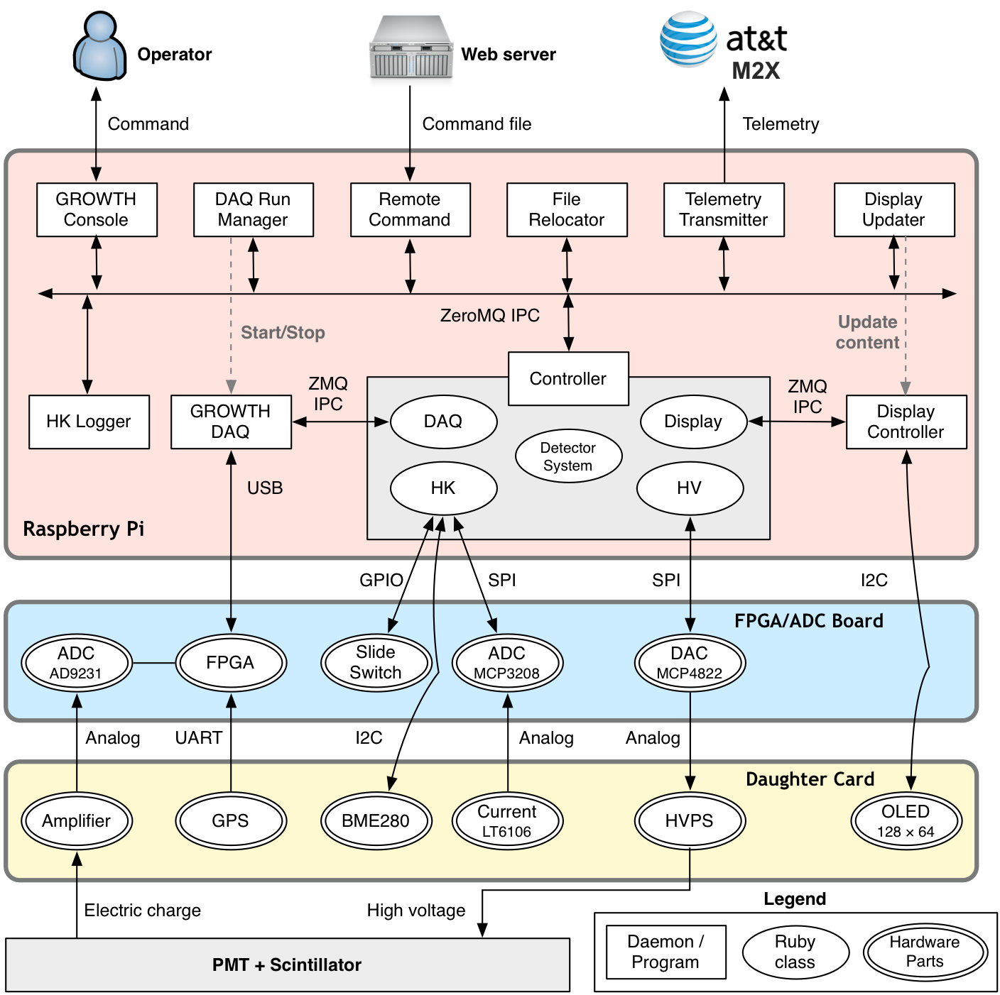

# GROWTH-DAQ

GROWTH実験のfy2016以降の検出器用の、検出器制御・ガンマ線イベント取得用プログラムのgitレポジトリです。

以下の説明は、検出器システムに組み込むRaspberry Pi上に、GROWTH-DAQをインストールする手順を説明しています。
GROWTH FPGA/ADCボードのみをMac等から利用する場合は、別途`daq/README.md`を参照してください。

## 1. 構成

GROWTH-DAQには、以下のようなプログラムが含まれています。

### 1.1 検出器制御デーモン

| プログラム名              | 処理内容                                                                             |
| :--:                      | :--                                                                                  |
| growth_controller.rb      | 検出器システムを制御するコアプログラム。                                             |
| growth_daq_run_manager.rb | DAQプログラム(ガンマ線イベント取得用プログラム)の観測開始・停止を制御。              |
| growth_display_server.py  | OLEDディスプレイを制御するデーモン。                                                 |
| growth_display_updater.rb | 定期的にHK情報や検出器の動作状況を収集して、OLEDディスプレイの表示内容を構築し表示。 |
| growth_file_relocator.rb  | 定期的にDAQプログラムやHK Loggerの出力ファイルを圧縮してYYYYMM/というサブディレクトリに移動。 |
| growth_hk_logger.rb       | HK情報をファイルに記録。 |
|growth_telemetry_transmitter.rb | [AT&T M2X](https://m2x.att.com)にテレメトリを送信。 |
|growth_remote_command_executor.rb | 指定されたURLから定期的にJSONファイルをダウンロードして、リモートコマンドを実行。|

これらのデーモンは、[ZeroMQ](http://zeromq.org)というメッセージ通信フレームワークをもちいたプロセス間通信
(Inter Process Communication; IPC)により、データや制御コマンドをやり取りし合います。

### 1.2 ガンマ線イベント取得用DAQプログラム

| プログラム名 | 処理内容                                                                     |
| :--:         | :--                                                                          |
| growth_daq   | FPGA/ADCボードにアクセスしてガンマ線イベントを読み出し、FITSファイルに保存。 |


### 1.3 手動制御用コンソール

| プログラム名      | 処理内容                 |
| :--:              | :--                      |
| growth_console.rb | 検出器制御用コンソール。 |

手動制御用コンソール(`growth_console`)を使うと、pryを用いたRubyのインタラクティブなコンソールが起動し、
コマンドラインから各デーモンの状態を監視したりコマンドを送信することができます。

### 1.4 ユーティリティ

| プログラム名           | 処理内容                                       |
| :--:                   | :--                                            |
| growth_parse_config.rb | growth_conifg.yamlをパースしてエラーチェック。 |

### 1.5 各種プログラムの相関関係



## 2. ダウンロードとインストール

### 2.1. ダウンロード

以下のようにしてgitレポジトリをダウンロードしてください。

```
cd $HOME
mkdir git
cd git

# growth-teamに登録している場合
git clone git@github.com:growth-team/GROWTH-DAQ.git

# growth-teamに登録していない場合
git clone https://github.com/growth-team/GROWTH-DAQ.git
```

### 2.2. 依存関係のインストール

以下を参考に、依存関係をインストールしてください。

Raspberry Piの場合:

```
cd $HOME/git/GROWTH-DAQ/setup
sudo ./install_apt-get.sh &> log_apt.text
sudo ./install_python.sh &> log_python.text
./install_adafruit_ssd1306.sh &> log_adafruit.text
sudo ./install_ruby_gem.sh &> log_ruby_gem.text
sudo ./install_wiringPi.sh &> log_wiringPi.text
```

### 2.3. growth_configファイルの設置

growth_configは、検出器固有の情報を設定するためのYAML形式のファイルで、`/home/pi/growth_config.yaml`として
設置されることが仮定されています。このファイルでは以下の情報を設定します。

- 検出器ID (detectorID)
- 高圧電源関連 (hv)
    - DACの設定値と高圧電源の出力電圧の変換式
    - 観測を自動実行するさいのデフォルトのHV設定値(DACの出力電圧mVで記述)
- 各種リミット (limits)
    - 温度リミット(degC)
    - HV値のリミット(HVの出力電圧値Vで記述)

`$HOME/git/GROWTH-DAQ/growth_config/`内に各検出器用のgrowth_config.yamlが入っているので、`$HOME`に
コピーしてください。新しい検出器用のファイルを作成した場合は、gitレポジトリに追加してgithubにpushしてください。

```
cp $HOME/git/GROWTH-DAQ/growth_config/growth-fy2016z/growth_config.yaml $HOME
```

`growth_config.yaml`の具体例を以下に掲載しておきます。

```yaml
detectorID: growth-fy2016z
hv:
    conversion:
        0: (x/3300)*1000
        1: (x/3300)*1000
    default:
        0: 130  <== DACの出力値(mV)で指定 ★HVの出力電圧ではないので注意★
        1: 330
limits:
    temperature:
        lower: -50
        upper: 45
    hv:
        0: 900  <== HVの出力値(V)で指定
        1: 900
```

`growth_parse_config.rb`を実行すると、`/home/pi/growth_config.yaml`の設定情報を読み込んで、
エラーがないか確認できます。

```
# PATHが通っていないので、まずPATHを設定
pi@raspberrypi[~]$ export PATH=$HOME/git/GROWTH-DAQ/controller/bin:$PATH

# RUBYLIBも設定
pi@raspberrypi[~]$ export RUBYLIB=$HOME/git/GROWTH-DAQ/controller/lib:$RUBYLIB

# 実行
pi@raspberrypi[~]$ growth_parse_config.rb
I, [2016-09-25T13:51:59.502707 #1409]  INFO -- growth_parse_config: [config] growth_config = /home/pi/growth_config.yaml
I, [2016-09-25T13:51:59.502974 #1409]  INFO -- growth_parse_config: [config] Loading /home/pi/growth_config.yaml
I, [2016-09-25T13:51:59.507964 #1409]  INFO -- growth_parse_config: [config] detectorID: growth-fy2016a
I, [2016-09-25T13:51:59.508331 #1409]  INFO -- growth_parse_config: [config] HV Ch.0 HV_V = (x/3300)*1000
I, [2016-09-25T13:51:59.508496 #1409]  INFO -- growth_parse_config: [config] HV Ch.1 HV_V = (x/3300)*1000
I, [2016-09-25T13:51:59.508636 #1409]  INFO -- growth_parse_config: [config] HV Ch.0 DAC_mV = 130
I, [2016-09-25T13:51:59.508745 #1409]  INFO -- growth_parse_config: [config] HV Ch.1 DAC_mV = 330
I, [2016-09-25T13:51:59.508896 #1409]  INFO -- growth_parse_config: [config] Temprature limit lower = -50 degC
I, [2016-09-25T13:51:59.509110 #1409]  INFO -- growth_parse_config: [config] Temprature limit upper = 45 degC
I, [2016-09-25T13:51:59.509257 #1409]  INFO -- growth_parse_config: [config] HV limit Ch.0 = 900 V
I, [2016-09-25T13:51:59.509364 #1409]  INFO -- growth_parse_config: [config] HV limit Ch.1 = 900 V
```

### 2.4. ガンマ線イベント取得プログラムgrowth_daqのビルド

```
cd $HOME/git/GROWTH-DAQ/daq

# Pull git submodules
git submodule init
git submodule update

# Build
mkdir build
cd build
cmake ..
make -j2
```

ビルドが終了すると`growth_daq`という実行形式ができているはずです。
がDAQプログラムです。

インストール先を指定したい場合は`cmake`のところで、

```
cmake .. -DCMAKE_INSTALL_PREFIX=$HOME/work/install
```

などとしてください。この例では、`make install`すると実行形式が`$HOME/work/install/bin/growth_daq`に保存されます。

`growth_daq`を手動で実行する際の詳細は`daq/README.md`を参照してください。

### 2.5. 自動起動の設定ファイルのインストール

以下のコマンドを実行すると、各プログラム(デーモン)を自動実行し、プロセスの存在を監視するために使用する
[God](http://godrb.com)の設定ファイルとinit.dスクリプトがインストールされます。次回の起動時から、
そのinit.dスクリプトによって、God自体と設定したgrowth関連のスクリプトがデーモンとして起動されます。

```
cd $HOME/git/GROWTH-DAQ/controller/
sudo make

# 再起動
sudo reboot
```

## 3. 検出器の自動制御

### 3.1. 動作状況の確認

上記の手順で自動起動用の設定ファイルをインストールした場合、reboot後しばらくすると、OLEDに情報が表示されるようになります(OLEDディスプレイを搭載した子基板を接続している場合)。
OLEDディスプレイに何も表示されないときは、I2Cの通信エラーか、ディレプレイ制御デーモン(`growth_display_server.py`と`growth_display_updater.rb`)が正しく起動していない
可能性があります。以下のようにして、growth関連のスクリプトの起動状況を確認してください。

```
pi@raspberrypi[god]$ ps -aux | /bin/grep growth_ 
root  759  1.4  1.9  58672 18304 ?  Ssl  13:44   0:37 ruby /home/pi/git/GROWTH-DAQ//controller/bin/growth_controller.rb --log-level=warn --log-device=file --log-dir=/var/log/growth
root       772  0.0  1.2  36004 12308 ?  Ssl  13:44   0:00 ruby /home/pi/git/GROWTH-DAQ//controller/bin/growth_daq_run_manager.rb --log-level=warn --log-device=file --log-dir=/var/log/growth
root       776  0.1  1.7  39328 16572 ?  Ssl  13:44   0:03 ruby /home/pi/git/GROWTH-DAQ//controller/bin/growth_display_updater.rb --log-level=warn --log-device=file --log-dir=/var/log/growth
pi  779  0.0  0.0   1912   384 ?  Ss   13:44   0:00 sh -c /home/pi/git/GROWTH-DAQ//daq/build/growth_daq  /dev/ttyUSB1 configuration_20160828_2247_fy2016.yaml 0     2> /var/log/growth/growth_daq.log 
root       785  0.6  1.3  46444 12792 ?  Ssl  13:44   0:15 python /home/pi/git/GROWTH-DAQ//controller/bin/growth_display_server.py
```

### 3.2. 観測の自動実行・停止

Godによる各種デーモンの自動起動が設定されている場合、`growth_daq_run_manager.rb`が一定間隔でHKデータを確認しています。
以下の条件が満たされると、(1) HVをデフォルト値に設定し、(2) HV出力をONしてから、(3) DAQプログラムに`daq.resume()`コマンドを送信して観測を開始します。

**自動観測開始の条件**

- FPGA/ADCボード上のスライドスイッチがON(FPGAチップに近い側)になっている
    - Note: ONになっているときは、OLEDディスプレイの3行目の末尾にAT(Automaticの意味)という文字が表示される
- SlowADCで計測しているPCB上の2点の温度が、`growth_config.yaml`で指定された温度リミットの範囲内

観測実行中に上記の条件が満たされなくなった場合、`daq.pause()`コマンドを送信して観測を一旦停止し、HVのDAC設定値を0Vに戻し、`hv.off_all()`で出力を全てOFFにします。

また、`growth_daq_run_manager.rb`は観測の経過時間を`daq.status()`コマンドで確認し、30分ごとに`daq.switch_output()`コマンドを送信して、保存先のFITSファイルを切り替えます。
このとき、`growth_daq`は再起動されないので、観測の切れ目がうまれないようになっています。

`growth_daq`がGodによって起動される際、カレントディレクトリは`$HOME/work/growth/data/growth-fy2016a`など(末尾は`detectorID`)になっています。
FITSファイルはそのディレクトリ内に保存されます。

検出器全体をシャットダウンするときは、(1) スライドスイッチをOFFにして自動観測を停止してから`sudo shutdown -h now`などでRaspberry Piを終了させてください。
普段は必要ありませんが、`daq.stop()`コマンドを実行すると、デーモンとして走っているDAQプログラムを終了させることが出来ます(その後、Godのプロセス監視により
30秒以内に再度実行されます)。

### 3.3 各プログラムのログファイル

デーモンとして動作している各プログラムのログファイルは`/var/log/growth/`以下に保存されています。
デフォルトでは、ファイルサイズを抑制するために、ログレベルがwarn (warning)以上のものしか記録しないようになっています。

```
pi@raspberrypi[~]$ ll /var/log/growth 
total 176K
-rw-r--r-- 1 root  14K Sep 25 13:50 growth_controller.log
-rw-r--r-- 1 root    0 Sep 25 13:44 growth_controller.stdout
-rw-r--r-- 1 pi      0 Sep 25 13:44 growth_daq.log
-rw-r--r-- 1 pi    46K Sep 25 13:44 growth_daq_run_manager.log
-rw-r--r-- 1 pi   103K Sep 25 13:44 growth_display_updater.log
```

ログレベルの設定は、Godが各プログラムを起動するときに引数としてわたしています。
ログレベルを変更した場合は、`$HOME/git/GROWTH-DAQ/controller/god/growth.god.conf`内で
各プログラムの起動コマンドの引数が`--log-level=warn`となっているところを`--log-level=info`や`--log-level=debug`に
変更してください。変更したファイルをインストールしないと反映されないので、変更後は

```
cd GROWTH-DAQ/controller/
sudo make
```

として、Godの設定ファイルをインストールしなおしてください。

### 3.4. デーモンの再起動

単体のデーモンだけ起動・再起動

```
sudo god start (デーモン名(.rbは除く))
sudo god restart (デーモン名(.rbは除く))

例:
sudo god start growth_daq_run_manager
sudo god restart growth_daq_run_manager
```

Godそのものと、すべてのデーモンを起動・停止・再起動
(`growth.god.conf`を更新してその結果を反映したいときなど)

```
sudo /etc/init.d/growth_god start
sudo /etc/init.d/growth_god stop
sudo /etc/init.d/growth_god restart
```

## 4. GROWTH Consoleによる検出器の手動制御・状態の監視

Godによる自動起動の設定をしたあとは、Raspberry Piの電源を入れると、検出器制御やOLEDディスプレイの更新、
DAQプログラムが自動的に起動し、観測開始の条件が満たされると(スライドスイッチ、PCBの温度など)、ガンマ線の
イベント取得が自動実行されます。

GROWTH Console (コンソール)を使うと、手動で検出器の状態を確認したり、設定を変更することができます。
`pry`という、Rubyのコマンドライン環境内で、各サブシステムに対してメソッドを呼び出すイメージです。

コンソールを使用するときは、バックグラウンドで`growth_controller`デーモンが動いている必要があります。
事前に上述のインストールを済ませて、Raspberry Piの電源投入後に`growth_controller`が起動している
ようにしてください。

### 4.1. コンソールの使い方

コンソールは以下のようにすると起動します。

```ruby
pi@raspberrypi[~]$ cd $HOME/git/GROWTH-DAQ/controller/bin
pi@raspberrypi[bin]$ ./growth_console.rb

From: /home/pi/git/GROWTH-FY2015-Software/controller/bin/growth_console.rb @ line 21 :

    16: daq  = GROWTH::ConsoleModuleDAQ.new("daq", logger: @logger)
    17: 
    18: #---------------------------------------------
    19: # Start console
    20: #---------------------------------------------
 => 21: binding.pry

[1] pry(main)>  (このコンソールはRubyコマンドをなんでも実行できます。)
```

各サブシステムを抽象化したオブジェクトが以下の名前で登録(インスタンス化)されています。
各サブシステムのインスタンスの名称と、用意されているメソッドは以下のとおりです。

- `det`: 検出器システム全体
    - `det.id()`: detectorID (growth-fy2016aなど)を問い合わせます。
    - `det.ip()`: IPアドレスを問い合わせます。
    - `det.hash()`: GROWTH-DAQのgitレポジトリのHEADのhashを問い合わせます。
    - `det.ping()`: pingして、`growth_controller`が動いているかを確かめます。
- `hk`: Housekeeping情報を抽象化したもの
    - `hk.read()`: HKデータを読み出します。
- `hv`: 高圧電源サブシステムを抽象化したもの
    - `hv.set(ch, DAC_mV)`: HVの値をDACの設定値で設定します(ch = 0 or 1、DAC_mV = DAC設定値)
    - `hv.on(ch)`: `ch`に対応するHVの出力を開始します。
    - `hv.off(ch)`: `ch`に対応するHVの出力を停止します。
    - `hv.off_all()`: 全てのHV出力を停止します。
- `disp`: OLEDディスプレイと、`growth_display_server.py`を抽象化したもの
    - `disp.clear()`: ディスプレイをクリアします。
    - `disp.display(str)`: strで指定した文字列を表示します。改行は`\n`で指定できます。
    - `disp.stop()`: OLEDディスプレイを管理している`growth_display_server.py`デーモンを終了します。
- `daq`: ガンマ線イベント取得用のDAQプログラム`growth_daq`を抽象化したもの
    - `daq.ping()`: DAQプログラムが動いているか確かめます。
    - `daq.pause()`: DAQプログラムが観測を実行中の場合、観測を停止します(FITSファイルは正常に閉じられます)
    - `daq.resume()`: DAQプログラムが観測を停止中の場合、観測を開始します(新しいFITSファイルにデータが記録されます)。
    - `daq.status()`: DAQプログラムのステータスを問い合わせます。
    - `daq.switch_output()`: DAQプログラムが観測中の場合、保存先のFITSファイルを新しいものに切り替えます。
    - `daq.stop()`: DAQプログラムを終了させます。

各コマンドを実行しすると、内部的に`growth_controller`とIPC(プロセス間通信)で通信し、
`growth_controller`で指定したコマンドが実行されます(OLEDとDAQプログラムのコマンドの場合は
さらに`growth_display_server.py`と`growth_daq`にコマンドが送られます)。コマンドと
レスポンスはJSON形式のメッセージなっています。pry内でコマンドを実行すると、受信されたJSON
メッセージが画面に表示されます。

使い方の具体例は以下を参照してください。エラーがおきたときは`"status"=>"error"`となり、
`"message"`欄にエラーメッセージが格納されます。

```ruby
[1] pry(main)> det.id 
I, [2016-09-25T13:17:01.400225 #9241]  INFO -- : [det] Sending command: {"command":"det.id","option":{}}
I, [2016-09-25T13:17:01.400529 #9241]  INFO -- : [det] Connecting to Controller...
I, [2016-09-25T13:17:01.404576 #9241]  INFO -- : [det] Connected to Controller
=> {"status"=>"ok", "detector_id"=>"growth-fy2016a", "subsystem"=>"det"}

[2] pry(main)> det.ip
I, [2016-09-25T13:17:03.393987 #9241]  INFO -- : [det] Sending command: {"command":"det.ip","option":{}}
=> {"status"=>"ok", "ip"=>"192.168.0.104", "subsystem"=>"det"}

[3] pry(main)> hk.read
I, [2016-09-25T13:17:08.973932 #9241]  INFO -- : [hk] Sending command: {"command":"hk.read","option":{}}
I, [2016-09-25T13:17:08.974331 #9241]  INFO -- : [hk] Connecting to Controller...
I, [2016-09-25T13:17:08.975802 #9241]  INFO -- : [hk] Connected to Controller
=> {"status"=>"ok",
 "unixtime"=>1474809429,
 "time"=>"2016-09-25T13-17-09",
 "hk"=>
  {"slow_adc"=>
    {"0"=>{"raw"=>871, "voltage"=>0.7019047619047618, "converted_value"=>44.464761904761886, "converted_string"=>"FPGA Temperature 44.46 degC", "units"=>"degC"},
     "1"=>{"raw"=>875, "voltage"=>0.7051282051282051, "converted_value"=>44.98051282051281, "converted_string"=>"DCDC Temperature 44.98 degC", "units"=>"degC"},
     "2"=>{"raw"=>526, "voltage"=>0.42388278388278383, "converted_value"=>423.8827838827838, "converted_string"=>" 12V Current 423.9 mA", "units"=>"mA"},
     "3"=>{"raw"=>400, "voltage"=>0.3223443223443223, "converted_value"=>161.17216117216117, "converted_string"=>"  5V Current 161.2 mA", "units"=>"mA"},
     "4"=>{"raw"=>590, "voltage"=>0.4754578754578754, "converted_value"=>475.4578754578754, "converted_string"=>"3.3V Current 475.5 mA", "units"=>"mA"},
     "5"=>{"raw"=>4008, "voltage"=>3.2298901098901096, "converted_value"=>4008, "converted_string"=>"Slow ADC 5", "units"=>"ch"},
     "6"=>{"raw"=>4010, "voltage"=>3.231501831501831, "converted_value"=>4010, "converted_string"=>"Slow ADC 6", "units"=>"ch"},
     "7"=>{"raw"=>4010, "voltage"=>3.231501831501831, "converted_value"=>4010, "converted_string"=>"Slow ADC 7", "units"=>"ch"}},
   "bme280"=>{"temperature"=>{"value"=>29.75, "units"=>"degC"}, "pressure"=>{"value"=>1005.63, "units"=>"mb"}, "humidity"=>{"value"=>61.01, "units"=>"%"}},
   "slide_switch"=>"on"},
 "subsystem"=>"hk"}

[4] pry(main)> daq.status
I, [2016-09-25T13:17:14.512992 #9241]  INFO -- : [daq] Sending command: {"command":"daq.status","option":{}}
I, [2016-09-25T13:17:14.513345 #9241]  INFO -- : [daq] Connecting to Controller...
I, [2016-09-25T13:17:14.514526 #9241]  INFO -- : [daq] Connected to Controller
=> {"daqStatus"=>"Running",
 "elapsedTime"=>92,
 "elapsedTimeOfCurrentOutputFile"=>92,
 "nEvents"=>8,
 "nEventsOfCurrentOutputFile"=>4,
 "outputFileName"=>"20160925_131542.fits",
 "status"=>"ok",
 "unixTime"=>1474809434,
 "subsystem"=>"daq"}

[5] pry(main)> hv.status
I, [2016-09-25T13:17:40.626613 #9241]  INFO -- : [hv] Sending command: {"command":"hv.status","option":{}}
I, [2016-09-25T13:17:40.627011 #9241]  INFO -- : [hv] Connecting to Controller...
I, [2016-09-25T13:17:40.628300 #9241]  INFO -- : [hv] Connected to Controller
=> {"status"=>"ok", "0"=>{"status"=>"on", "value_in_mV"=>130.0}, "1"=>{"status"=>"on", "value_in_mV"=>330.0}, "subsystem"=>"hv"}

[6] pry(main)> daq.status
I, [2016-09-25T13:17:52.161261 #9241]  INFO -- : [daq] Sending command: {"command":"daq.status","option":{}}
=> {"daqStatus"=>"Paused",
 "elapsedTime"=>130,
 "elapsedTimeOfCurrentOutputFile"=>0,
 "nEvents"=>8,
 "nEventsOfCurrentOutputFile"=>4,
 "outputFileName"=>"None",
 "status"=>"ok",
 "unixTime"=>1474809472,
 "subsystem"=>"daq"}

[7] pry(main)> hv.status
I, [2016-09-25T13:17:53.949861 #9241]  INFO -- : [hv] Sending command: {"command":"hv.status","option":{}}
=> {"status"=>"ok", "0"=>{"status"=>"off", "value_in_mV"=>0}, "1"=>{"status"=>"off", "value_in_mV"=>0}, "subsystem"=>"hv"}

[8] pry(main)> hk.read
I, [2016-09-25T13:18:00.328782 #9241]  INFO -- : [hk] Sending command: {"command":"hk.read","option":{}}
=> {"status"=>"ok",
 "unixtime"=>1474809480,
 "time"=>"2016-09-25T13-18-00",
 "hk"=>
  {"slow_adc"=>
    {"0"=>{"raw"=>871, "voltage"=>0.7019047619047618, "converted_value"=>44.464761904761886, "converted_string"=>"FPGA Temperature 44.46 degC", "units"=>"degC"},
     "1"=>{"raw"=>876, "voltage"=>0.7059340659340658, "converted_value"=>45.10945054945053, "converted_string"=>"DCDC Temperature 45.11 degC", "units"=>"degC"},
     "2"=>{"raw"=>517, "voltage"=>0.4166300366300366, "converted_value"=>416.6300366300366, "converted_string"=>" 12V Current 416.6 mA", "units"=>"mA"},
     "3"=>{"raw"=>387, "voltage"=>0.31186813186813184, "converted_value"=>155.93406593406593, "converted_string"=>"  5V Current 155.9 mA", "units"=>"mA"},
     "4"=>{"raw"=>622, "voltage"=>0.5012454212454212, "converted_value"=>501.24542124542114, "converted_string"=>"3.3V Current 501.2 mA", "units"=>"mA"},
     "5"=>{"raw"=>4011, "voltage"=>3.232307692307692, "converted_value"=>4011, "converted_string"=>"Slow ADC 5", "units"=>"ch"},
     "6"=>{"raw"=>4010, "voltage"=>3.231501831501831, "converted_value"=>4010, "converted_string"=>"Slow ADC 6", "units"=>"ch"},
     "7"=>{"raw"=>4010, "voltage"=>3.231501831501831, "converted_value"=>4010, "converted_string"=>"Slow ADC 7", "units"=>"ch"}},
   "bme280"=>{"temperature"=>{"value"=>29.77, "units"=>"degC"}, "pressure"=>{"value"=>1005.62, "units"=>"mb"}, "humidity"=>{"value"=>61.05, "units"=>"%"}},
   "slide_switch"=>"on"},
 "subsystem"=>"hk"}

[9] pry(main)> quit
```

### 4.2. 自動観測実行・停止の解説

上の例では、自動観測実行・停止を試験するために、`growth_config.yaml`内の温度リミット設定を45 degCという、とても低い温度にしていました。
ちょうど試験中に温度が変化して、リミットを超えて観測が自動的に停止されている様子を以下に順に開設します。

[3]でHKを確認した時点ではSlowADCのCh.0とCh.1のPCB温度が以下のように45 degC以下だった:

```ruby
[3] pry(main)> hk.read
"0"=>{"raw"=>871, "voltage"=>0.7019047619047618, "converted_value"=>44.464761904761886, "converted_string"=>"FPGA Temperature 44.46 degC", "units"=>"degC"},
"1"=>{"raw"=>875, "voltage"=>0.7051282051282051, "converted_value"=>44.98051282051281, "converted_string"=>"DCDC Temperature 44.98 degC", "units"=>"degC"},
```

ので、DAQプログラムの自動観測が実行されているため、[4]でDAQプログラムのステータスを確認したときに、

```ruby
[4] pry(main)> daq.status
=> {"daqStatus"=>"Running",     <===== 観測実行中
 "elapsedTime"=>92,
 "elapsedTimeOfCurrentOutputFile"=>92,
 "nEvents"=>8,
 "nEventsOfCurrentOutputFile"=>4,
 "outputFileName"=>"20160925_131542.fits",
 "status"=>"ok",
 "unixTime"=>1474809434,
 "subsystem"=>"daq"}
```

となっています。

観測実行中はHVのステータスも以下のようになっており、HVが出力されています(設定値は適当な値をgrowth_config.yamlに書いていたので、あくまで例です)。

```ruby
[5] pry(main)> hv.status
=> {"status"=>"ok", 
    "0"=>{"status"=>"on", "value_in_mV"=>130.0}, <=== Ch.0 ON == 出力中
    "1"=>{"status"=>"on", "value_in_mV"=>330.0}, <=== CH.1 ON == 出力中
    "subsystem"=>"hv"}
```

その後しばらくして、PCBの温度が上昇しました。OLEDディスプレイの表示によると観測が自動停止したので、`daq.status()`を送信してみると、以下のように一時停止されていました。

```ruby
[6] pry(main)> daq.status
=> {"daqStatus"=>"Paused",   <==== 観測一時停止中
 "elapsedTime"=>130,
 "elapsedTimeOfCurrentOutputFile"=>0,
 "nEvents"=>8,
 "nEventsOfCurrentOutputFile"=>4,
 "outputFileName"=>"None",
 "status"=>"ok",
 "unixTime"=>1474809472,
 "subsystem"=>"daq"}
```

HV出力もOFFになっています。

```ruby
[7] pry(main)> hv.status
=> {"status"=>"ok", 
    "0"=>{"status"=>"off", "value_in_mV"=>0}, <=== HV Ch.0 OFF
    "1"=>{"status"=>"off", "value_in_mV"=>0}, <=== HV Ch.1 OFF
    "subsystem"=>"hv"}
```

HKで温度を確認すると以下のように、SlowADC Ch.1で計測しているDCDCコンバータ付近の温度計の値が45 degCを超えており、これが原因で自動停止されたことが確認できます。

```ruby
[8] pry(main)> hk.read
    {"0"=>{"raw"=>871, "voltage"=>0.7019047619047618, "converted_value"=>44.464761904761886, "converted_string"=>"FPGA Temperature 44.46 degC", "units"=>"degC"},
     "1"=>{"raw"=>876, "voltage"=>0.7059340659340658, "converted_value"=>45.10945054945053, "converted_string"=>"DCDC Temperature 45.11 degC", "units"=>"degC"},
```

実際の観測運用では、リミット温度はもう少し高く設定することになる予定です。
